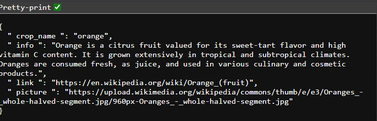
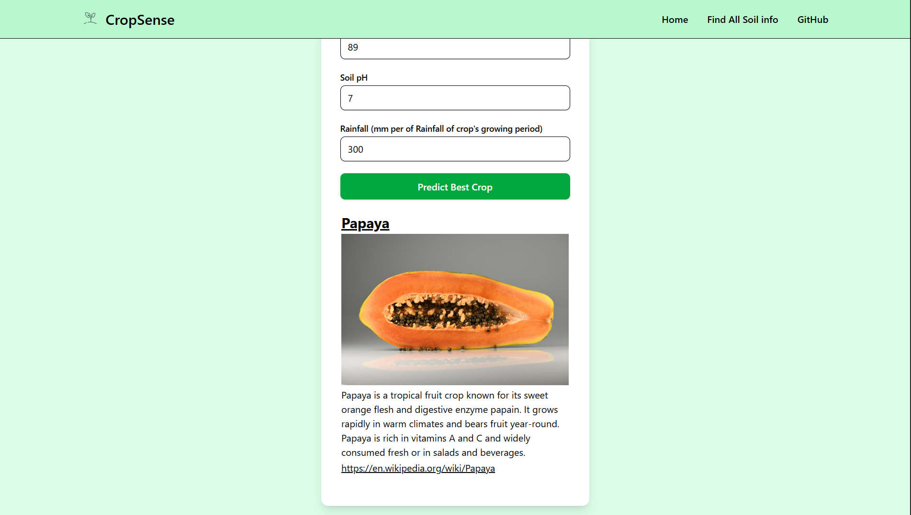

# CropSense

## Overview:

CropSense uses a trained machine learning model to predict the most suitable crop based on environmental parameters. The system features a Flask-based REST API backend deployed on Render

## Architecture:

### Machine learning model:

- Machine learning algorithm which I used to train this model is Random Forest Classifier form sklearn
- The model is trained using indian_crop dataset from kaggle
- Random Forest Classifier trained on 2,200 samples
- 22 crop classes prediction
- Takes in 7 Paramenter for a prediction

### Backend (Main part) :

- API Framework : Flask
- Using flask to create API endpoint
- The API endpoints take the following parameters:
  1. Nitrogen (N) contnet in the soil (in PPM) -> N
  2. Phosphorus (P) contnet in the soil (in PPM) -> P
  3. Potassium (K) contnet in the soil (in PPM) -> K
  4. Temprature in that area () -> T
  5. Humidity content in the air (%) -> H
  6. Soil pH of the soil -> pH
  7. Railfall of the crop's growing season (in mm) -> R
- Takes the prediction from ML model and then queries from a predefined database of 22 crops for picture ,info and wiki link and then returns it.
- The backend is deployed in Render.

#### Example Request :

    https://cropsense-lbv0.onrender.com/predict?N=30&P=20&K=10&T=18&H=55&pH=5.5&R=120

- Result :
  

### Frontend(Just to demonstrate the API):

- HTML: Structure and layout
- JavaScript: Fetch API from backend
- TailwindCSS: Responsive styling and modern UI design

#### Preview:

## Want to setup yourself ?

- First git clone the repository
    git clone https://github.com/shahansshetty/CropSense.git

### Backend setup

1. Cd to backend folder
    cd backend

2. Install all requirements.txt  
    pip install -r requirements.txt

3. To run you flask api in ur localhost run
    python main.py

### Frontend setup :

1. Cd to frontend folder from root folder
    cd frontend

2. To run the frontend in localhost , install live server extension and then run it.

### Enjoy !!
